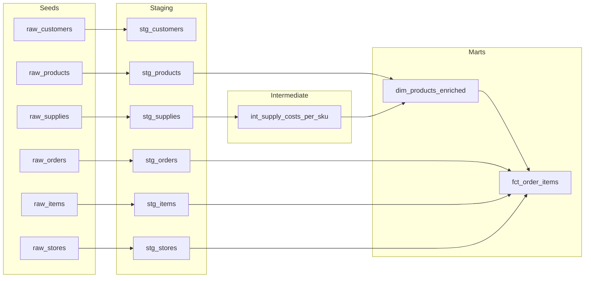

# Jaffle Shop Profitability Pipeline | dbt + BigQuery

**🥈 Runner-up (2nd place), Birmingham Business School × dbt Labs Analytics Engineering Hackathon, 2026**

Presented by [Vishal Kumar](https://github.com/vishalk2712)

## Business question

**Which product lines generate the most gross profit, and how does their exposure to perishable supply costs relate to gross margin?**

This three-layer dbt pipeline uses the workshop's Jaffle Shop sample data to answer that question at the grain of one sold item. The data is synthetic, so the monetary results describe this sample dataset rather than a real business. The repository shows the path from source records to tested financial measures and a decision-oriented recommendation.

## Pipeline and grain

| Layer | Models | Purpose |
| --- | --- | --- |
| Seeds and staging | Six `raw_*` CSV seeds and six `stg_*` models | Load and standardise customers, orders, items, products, stores and supplies. Document each source's grain. |
| Intermediate | [`int_supply_costs_per_sku`](models/intermediate/int_supply_costs_per_sku.sql) | Sum total, perishable and non-perishable supply costs to **one row per SKU** before joining to sales. |
| Marts | [`dim_products_enriched`](models/marts/dim_products_enriched.sql), [`fct_order_items`](models/marts/fct_order_items.sql) | Attach product and cost measures to each sold item; expose revenue, cost and gross profit for analysis. |

`fct_order_items` has **one row per `item_id`**. The source contains no quantity column, so each item row represents one unit sold. Product price is attributed as item revenue; the sum of supplies associated with its SKU is attributed as item cost. The model stores monetary values in **cents**, matching the seeds.

### Model lineage

This diagram is derived from the models' dbt `ref()` dependencies:



`stg_customers` is documented as part of the workshop source layer; it is not an input to the profitability fact model. The separate `models/moms_flower_shop/staging/` exercise is outside this pipeline.

## Data quality checks

The schema YAML files define the checks that run with `dbt build`:

| Check | Where | What it protects |
| --- | --- | --- |
| `unique` and `not_null` | Staging primary keys, `int_supply_costs_per_sku.sku`, `dim_products_enriched.product_id`, `fct_order_items.item_id` | The declared grain of each model. |
| `not_null` | Order, customer, store and product references used downstream | Required identifiers are present before joins and reporting. |
| `dbt_utils.unique_combination_of_columns` | `(supply_id, product_id)` in `stg_supplies` | Duplicate supply-to-SKU pairs; `supply_id` alone is expected to repeat. |
| `dbt_utils.expression_is_true` with `>= 0` | Intermediate total supply cost and fact item/perishable costs | Negative cost values reaching margin calculations. |

See the [staging](models/staging/schema.yml), [intermediate](models/intermediate/schema.yml) and [mart](models/marts/schema.yml) test definitions. The cost checks are dbt generic tests, not a separate custom SQL test file.

## The fan-out defect

Reviewing the joins revealed a grain mismatch: one SKU can have several supply rows. Joining `raw_items` directly to `raw_supplies` on SKU expands the **997 sold-item rows to 5,559 rows** in these seeds. Aggregating that joined result would count an item's revenue once per linked supply and distort profitability.

The pipeline resolves this by summing supply costs **per SKU first** in `int_supply_costs_per_sku`, then joining that single SKU-level row to products and sold items. The `unique` test on `fct_order_items.item_id` checks that the final fact table still has one row per sold item. The row counts above were reproduced from the committed CSV seeds; they describe the direct-join failure mode and the expected fact grain.

## Margin finding

The seed-based calculation follows the SQL model's price-minus-supply-cost logic. Dollar figures below are converted from the cents stored in the source fields.

| Product line | Items sold | Revenue | Supply cost | Gross profit | Gross margin | Perishable share of supply cost |
| --- | ---: | ---: | ---: | ---: | ---: | ---: |
| Beverage | 805 | $4,510.00 | $890.89 | $3,619.11 | **80.25%** | **72.89%** |
| Jaffle | 192 | $2,308.00 | $514.83 | $1,793.17 | **77.69%** | **89.18%** |

The corresponding source totals in cents are **451,000 / 89,089 / 361,911** for beverage revenue / cost / profit, and **230,800 / 51,483 / 179,317** for jaffles.

**Gross profit = revenue − supply cost. Gross margin = gross profit ÷ revenue. Perishable cost share = perishable supply cost ÷ total supply cost.** Beverages lead on both revenue and gross profit. Jaffles have a perishable cost share about **16.3 percentage points higher** and a gross margin about **2.6 points lower**. This association suggests where to investigate cost reduction; it does not establish that perishability alone caused the margin gap.

**Recommendation:** review supplier terms for perishable jaffle inputs and test suitable shelf-stable alternatives, then remeasure margin. All **686 orders** in the seed data come from Philadelphia; the other five stores have no order history, so a store-level profitability comparison is not supported yet. Re-run the analysis by `store_id` when those locations have sales data.

## Reproduce

Configure a BigQuery project and a local dbt profile named `university_workshop`, matching [`dbt_project.yml`](dbt_project.yml). Keep credentials in `~/.dbt/profiles.yml` or another ignored local profile file. Then run:

```bash
dbt deps
dbt seed
dbt build --select +fct_order_items +dim_products_enriched
dbt docs generate
dbt docs serve
```

To check the percentages against a BigQuery build, replace the table path with the dataset created by your dbt profile and run:

```sql
select
    product_type,
    count(*) as items_sold,
    round(100 * safe_divide(sum(item_gross_margin), sum(item_revenue)), 2) as gross_margin_pct,
    round(100 * safe_divide(sum(item_perishable_cost), sum(item_cost)), 2) as perishable_cost_share_pct
from `your_project.your_dataset.fct_order_items`
group by product_type
order by product_type;
```

The selected build covers the profitability lineage and its tests. The flower-shop exercise has a workshop-specific source project and needs its source configuration updated before building it elsewhere. The figures above were independently checked from the committed CSVs and model logic; a fresh BigQuery build requires your own credentials.

## Source and licence

The project began with the [dbt Labs university workshop starter](https://github.com/atrivedi-dbtlabs/university_workshop_starter), using [Jaffle Shop](https://github.com/dbt-labs/jaffle-shop) sample data. The starter's [MIT licence](LICENSE) and original Git history are retained.
